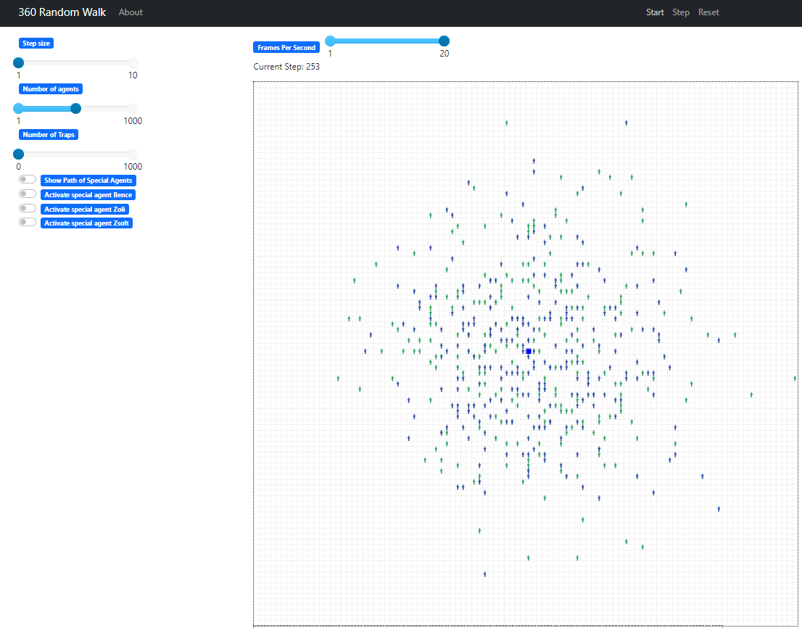
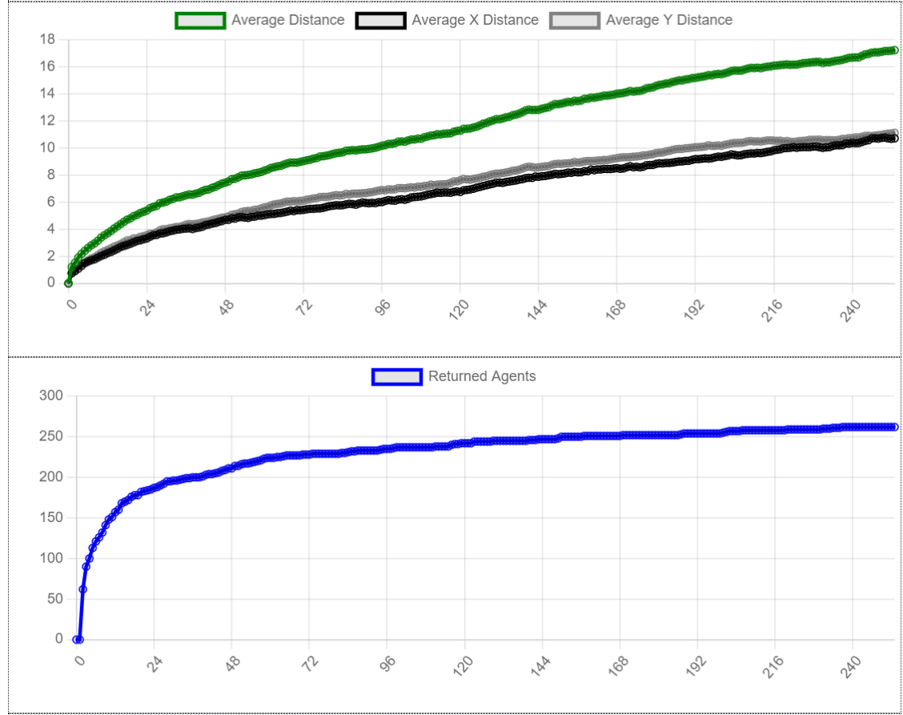
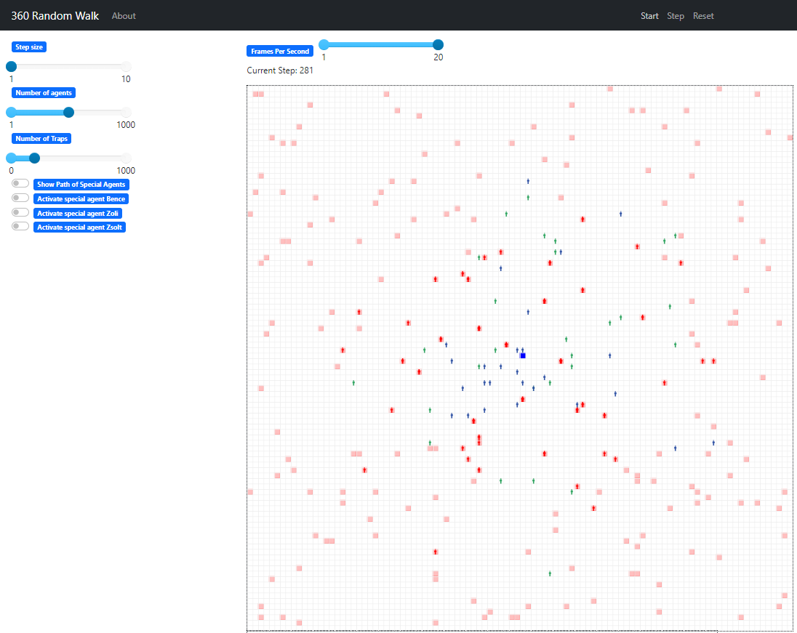
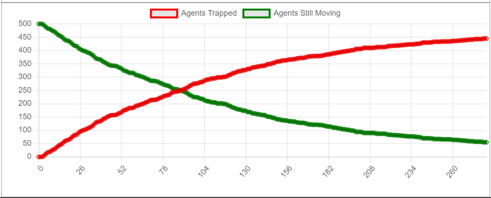
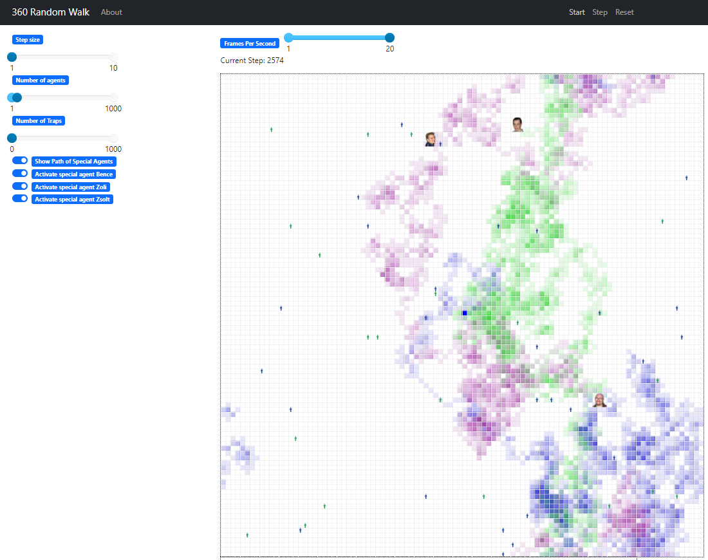
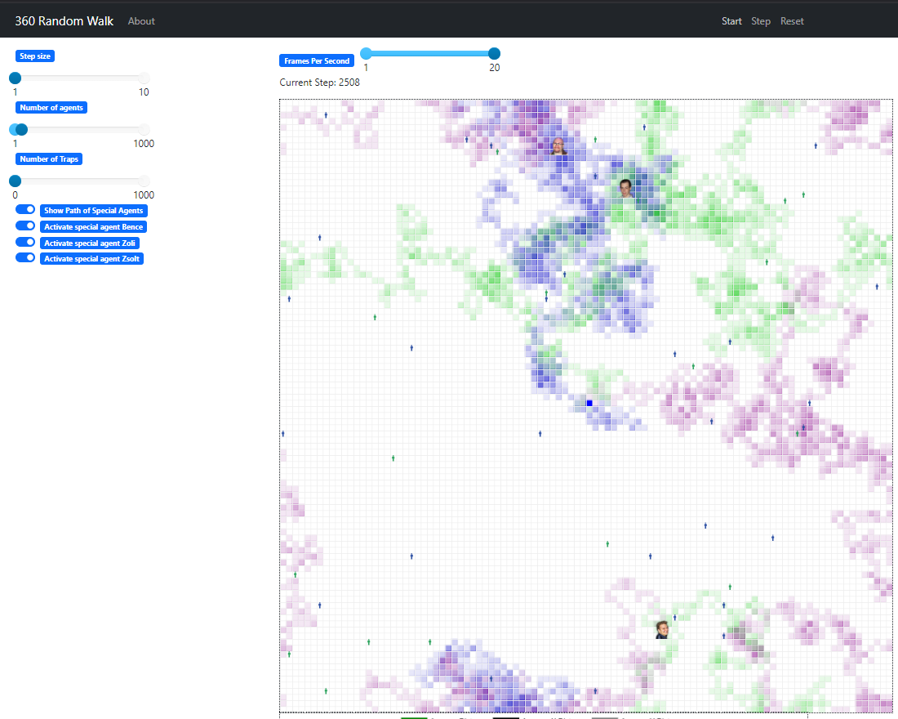

# Simulation Project

This project simulates a grid-based environment where agents move around.
Objects on the grid (traps, home, moving agents, path markers) are coded as agents.
Special agents may be added to the simulation with custom behavior.
The simulation is powered by the Mesa framework.

## Table of Contents

- [Overview](#overview)
- [Netlogo project implementation](#netlogo-implementation)
- [Random Walk Model](#random-walk-model)
- [Customization and Improvements](#customization)
- [Credits and License](#credits-and-license)

## Overview
My work is an implementation of the 'Random Walk 360' NetLogo project.  
(Refer to the 'Credits' section at the bottom of this document for a useful link).  
However, it goes beyond the original by adding unique features.

- **Grid-based simulation**: Agents move on a 100x100 grid (a 2D plane shaped like a torus).
- **Agents**: Multiple agents are simulated with random movements through random activation method.
- **Home**: The home base is located at the center of the grid (represented by a dark blue cell).
- **Returning Agents**: Counting agents, who returned to the center after the first step done.
- **Trap mechanism**: Agents can be trapped if they step on a trap. Traps are randomly generated.
- **Special Agents**: Special agents can be added with path visualization.
- **Data Collection**: The simulation collects various metrics, such as the number of agents that return to the home base and average distances traveled.
- **Visualization**: The simulation visualizes agents, traps, paths, and other data using the Mesa framework.


## NetLogo Project Implementation (Differences and Similarities)
The simulation models a population dispersing in random directions from a central location (home base).  
The number of individuals (agents) and their step size can easily be adjusted using sliders.  
Other properties of the grid and agents' movement (e.g., height, width, torus, Moore neighborhood) can only be modified in the code.  

### Basic implementation
Here is an example of a simple simulation with 500 agents over 250 steps.
While the simulation is running, data is collected on the agents' positions.
<br>


<br>
While green pictograms represent common moving agents, blue is for returned agents.  
Returned agents are those that have returned to the origin at some point during the simulation.  
This status cannot be lost or overwritten, so returned agents are counted only once.  
This number is added to the total sum of returned agents and plotted on the second chart.  
The first chart shows the average Euclidean distance of agents from the center, regardless of their returned status.  

### Simulation with traps
Interestingly, running a simulation with a number of activated traps does not significantly change the shape of these graphs.  
Red squares on the grid represent traps. If an agent steps into a trap, it remains immobile for the rest of the simulation.  
Trapped agents are represented by red pictograms.
<br>  


<br>
It is also common sense, that more traps capture agents faster.
Even larger step size is not helping much, since traps are distributed with equal randomness on the grid, just like choosing destination for an agent.
The only thing which could significantly change the chances of agents would be the immunity feature discussed below (Improvement section).
<br>
The simulation ends when all agents are trapped.

### An important thing to notice
The original NetLogo project allows agents to turn in discrete directions of 360 degrees.  
In contrast, my project focuses on modeling a common random walk in 2 dimensions, with only 4 possible directions.
(With default Moore-neighborhood set to True it is 8, including diagonal cells).
However, by scaling the step size, agents can effectively move in more directions.

Based on the firm mathematical background, this setting is not relevantly changing the outcome,
however charts and path curve would be smoother with more directions.


## Random Walk Model
The term random walk was first introduced by Karl Pearson in 1905.
In English, it is sometimes referred to as a drunkard's walk.

In mathematics, a random walk is a stochastic process.
It describes a path on some mathematical set, such as a coordinate-based Euclidean plane, consisting of random steps.

Our renowned Hungarian mathematician, George Pólya (one of the famous "Martians"), conducted research related to this topic.

Practical applications of the model include:
- The trajectory of a molecule moving through a liquid or gas (see Brownian motion)
- The path of an animal searching for food
- The fluctuating prices of market stocks
- The financial situation of a gambler

The set of points visited randomly exhibits interesting geometric properties.
In fact, it forms a discrete fractal, meaning a set that shows stochastic self-similarity.
To illustrate this property, I created the "Special Agents" (SA).
(Look for SA in 'Credits' section at the bottom of this document).
Using the activation slider, we can display the path traveled by an SA during the simulation.
The opacity of the trail for any SA is set to 10%, meaning a maximum of 10 repetitions can be visualized on a single cell of the path.
Darker-colored cells, therefore, indicate areas where the agent has passed more frequently.

For example, the following pattern is visible after 2,500 steps with one activated SA:
<br>

<br>
If all three SA are active, the visualization (also after 2,500 steps) looks like this:
<br>


<br>
This simulation was run with 'step size = 1' and do not forget, the agents are running on a torus.
In our model, this means that at each step, any agent randomly (with same probability) selects one of the Moore-neighboring grid cells exactly one unit away.
This provides a total of 8 possible directions.
It is clear that the visualization occurs on a 2D grid, but it can correspond to a random walk with 3 degrees of freedom.

So, this should actually look something like this:
<br>

<br>(Image source: Wikipedia)


## Customization and Improvements

To customize the simulation for your own needs, here are some guidelines:

### 1. **Customizing Agent Immunity and Trap Interactions**

In the current simulation, you can enhance the behavior of agents by adding an **immunity feature** for returned agents.
This feature ensures that once agents return to their home base (the center), they become immune to traps for a limited period.
If they step into a trap while immune, they lose their immunity and must return home again to regain it.
This adds an interesting dynamic to the simulation and it makes possible of modelling more complex systems.

#### How to Implement Immunity for Returned Agents

To implement the immunity feature:

1. **Track the Returned Status**: When an agent reaches home (the center of the grid), mark it as having "returned."
2. **Immunity Mechanism**: Once the agent returns home, it becomes immune to traps.
3. **Losing Immunity**: If an immune agent steps into a trap, it loses its immunity and must return home to regain it.

#### Steps to Implement:

1. **Modify the SimulationAgent Class**:
   - Add a `returned` attribute to track when an agent returns to the home base.
   - Add an `immune` attribute to track whether the agent is immune to traps.

2. **Adjust the `move()` Method**:
   - When an agent returns home, mark it as immune.
   - Once the agent is trapped, reset the immunity status.

3. **Modify the `trapped_agents()` Function**:
   - Before applying the trapping logic, check if the agent is immune.

**Example Implementation**:

```python
class SimulationAgent(Agent):
    def __init__(self, model, unique_id):
        super().__init__(model=model, unique_id=unique_id)
        self.immune = False  # Track if agent is immune
        self.returned = False  # Track if agent has returned home

    def step(self):
        if self.moving:
            self.move()
            # If the agent returns to the home base (center), it becomes immune
            if self.pos == self.model.center and not self.returned:
                self.returned = True
                self.immune = True  # Gain immunity

    def move(self):
        if self.immune:  # If the agent is immune, they can move freely
            pass
        else:
            super().move()  # Normal movement for non-immune agents

def trapped_agents(model: SimulationModel):
    """Freeze agents that step into a trap."""
    trapped_agents = 0
    for agent in model.schedule.agents:
        # Skip trapping if the agent is immune (and has returned home)
        if agent.immune:
            continue
        for trap in model.traps:
            if agent.pos == trap.pos and not agent.path_marker:
                agent.moving = False
                agent.trapped = True
                trapped_agents += 1
    return trapped_agents
```

#### How it Works:

- **Immunity Activation**: Once an agent reaches home (position is the center), it becomes immune to traps.
- **Immunity Deactivation**: If an agent steps into a trap while immune, it loses its immunity and can only regain it by returning home.
- **Flexible Behavior**: This mechanism allows for more dynamic and strategic agent movement, especially in environments with many traps.


### 2. **Adding New Types of Interactions**

To introduce new interactions, such as adding more types of objects (e.g., obstacles, collectible items, etc.) or complex behaviors (e.g., agents avoiding certain areas):

- **Define new agent types** (e.g., `Obstacle`, `Item`).
- **Implement interactions** by modifying how agents and objects interact with each other in the `step()` method of the `SimulationAgent` class.

**Example:**
```python
class Obstacle(Agent):
    def __init__(self, model, unique_id, pos):
        super().__init__(model, unique_id)
        self.pos = pos
        self.block_duration = 3  # Number of steps to block the agent

    def interact(self, agent):
        # Define interaction, like blocking movement for a few steps
        if self.pos == agent.pos:
            agent.blocked_steps = self.block_duration  # Start blocking the agent


class SimulationAgent(Agent):
    def __init__(self, model, unique_id):
        super().__init__(model=model, unique_id=unique_id)
        self.moving = True
        self.blocked_steps = 0  # Tracks how many steps the agent is blocked

    def step(self):
        # Check if the agent is currently blocked
        if self.blocked_steps > 0:
            self.blocked_steps -= 1  # Reduce the block duration each step
            return  # Skip the movement step

        # Otherwise, move the agent normally
        if self.moving:
            self.move()

```
#### How it Works:

- **Obstacle Blocking Duration**: The `Obstacle` class includes a `block_duration` attribute that specifies how many steps an agent is blocked when it encounters the obstacle.
- **Interaction Logic**: The `interact` method of the `Obstacle` class sets the agent's `blocked_steps` attribute to the obstacle's `block_duration`.
- **Agent Behavior**: 
  - The `SimulationAgent` class has a `blocked_steps` attribute initialized to `0`.
  - During each step, the agent checks if it is blocked (`blocked_steps > 0`), reduces the block duration, and skips movement until the blocking duration expires.

### 3. **Modifying behaviour of Special Agents**

To add new types of agents to the simulation:
- Modify the `SimulationAgent` class to include new agents.
- Define the unique IDs for each new special agent.
- Add the new agent to the `special_agent_ids` list if it is a special agent.
- Define custom behavior for each agent within the `SimulationAgent` class, such as how it moves or interacts with other agents.

**Example:**
```python
class SimulationAgent(Agent):
    special_agent_ids = [1, 7, 42, 100]  # Added new special agent with ID 100
    
    def __init__(self, model, unique_id):
        super().__init__(model=model, unique_id=unique_id)
        # Additional attributes specific to the new agent can be added here
        self.new_behavior = False  # Example for new agent behavior

    def step(self):
        if self.moving:
            self.move()  # Define custom movement behavior if needed
```
### 4. **Improving Trap Placement and Shapes**

Currently, traps are placed randomly on the grid, but you can enhance the simulation by implementing more structured or creative trap placements. This allows for a more strategic environment and opens possibilities for complex agent behaviors.

#### How it Works:

- **Custom Shapes**: Place traps in specific patterns like lines, circles, or custom shapes (e.g., spirals, clusters).
- **Dynamic Placement**: Implement traps that move or change positions during the simulation to add more challenges.
- **Pattern-Based Placement**: Use mathematical functions to define patterns (e.g., sine waves, spirals) or provide a list of predefined positions.

#### Example: Adding Circular Trap Patterns

```python
import numpy as np

def generate_circular_traps(model, radius, center=None):
    """Generate traps in a circular pattern, ensuring (int, int) positions."""
    traps = []
    occupied_positions = set()
    center = center or model.center  # Default to the grid's center

    for angle in range(0, 360, 15):  # Place traps every 15 degrees
        # Calculate trap position using trigonometric functions
        x = int(center[0] + radius * np.cos(np.radians(angle)))
        y = int(center[1] + radius * np.sin(np.radians(angle)))

        # Ensure trap isn't placed at the same spot or outside grid bounds
        if (0 <= x < model.width and 0 <= y < model.height) and \
           (x, y) != model.center and (x, y) not in occupied_positions:
            trap = core_agent_generator(
                model=model,
                unique_id=len(traps) + model.n_agents + 1,
                pos=(x, y),
                trap=True,
                moving=False
            )
            traps.append(trap)
            occupied_positions.add((x, y))

    return traps
```

#### Example: Line-Based Trap Patterns

```python
def generate_line_traps(model, start_pos, direction, length):
    """Generate traps in a straight line."""
    traps = []
    occupied_positions = set()
    dx, dy = direction  # Direction as a tuple, e.g., (1, 0) for horizontal line

    for i in range(length):
        x = start_pos[0] + i * dx
        y = start_pos[1] + i * dy

        # Ensure position is within grid bounds and not occupied
        if (0 <= x < model.width and 0 <= y < model.height) and (x, y) not in occupied_positions:
            trap = core_agent_generator(
                model=model,
                unique_id=len(traps) + model.n_agents + 1,
                pos=(x, y),
                trap=True,
                moving=False
            )
            traps.append(trap)
            occupied_positions.add((x, y))

    return traps
```

#### Flexible Trap Placement Ideas:

- **Cluster Traps**: Group traps in clusters with random radii and positions.
- **Dynamic Traps**: Create traps that move every few steps.
- **Interactive Traps**: Add traps that trigger additional effects, like blocking paths or spawning other objects.

These improvements can add more strategic depth to your simulation while enhancing its visual and behavioral complexity.


### 5. **Adjusting the Grid Size or Simulation Parameters**

You can easily adjust the grid size or other simulation parameters by modifying the values in the `SimulationModel` class when initializing the model. This includes parameters such as grid dimensions (height and width), step size, number of agents, and number of traps.

- **Grid Size**: Change the `height` and `width` parameters when initializing the `SimulationModel`.
- **Step Size**: Adjust the `step_size` to control how far agents move per step.
- **Number of Agents**: Set the `n_agents` parameter to define how many agents will be created in the simulation.
- **Number of Traps**: Use the `n_traps` parameter to control the number of traps on the grid.

**Example:**
```python
model = SimulationModel(
    height=100,
    width=100,
    n_agents=200,
    step_size=2,
    n_traps=50,
    show_path=True,
    special_agent_Bence=True,
    special_agent_Zoli=False,
    special_agent_Zsolt=True
)
```

### 6. **Customizing Path Visualization**

You can also modify how paths are visualized for special agents. The current setup uses colors for path markers, but you can change these colors or add new visualizations.

- **Update the `model_portrayal()` function** to customize how paths for different agents are shown.
- **Add conditions** to vary the colors, shapes, or layers based on agent attributes.

**Example:**
```python
def model_portrayal(obj):
    if isinstance(obj, simulation.SimulationAgent) and obj.path_marker:
        if obj.special_agent:
            # Use unique colors for each special agent's path
            if obj.unique_id == 1:
                portrayal["Color"] = "rgba(144, 238, 144, 0.5)"  # Light Green for Bence
            elif obj.unique_id == 7:
                portrayal["Color"] = "rgba(0, 0, 0, 0.5)"  # Dark Gray for Zoli
            elif obj.unique_id == 42:
                portrayal["Color"] = "rgba(20, 20, 144, 0.5)"  # Dark Blue for Zsolt
```


## Credits and License
This project is licensed under the SZTE MatMod2 License.
<br>
<br>
**Introducing Special Agents:**
<br>
<br>Bence, Consultant:

<br>Zoli, Consultant:

<br>Zsolt, Lecturer:


**Other Credits:**
- https://www.netlogoweb.org/launch#https://www.netlogoweb.org/assets/modelslib/Sample%20Models/Mathematics/Probability/Random%20Walk%20360.nlogo
- Wilensky, U. (1997). NetLogo Random Walk 360 model. http://ccl.northwestern.edu/netlogo/models/RandomWalk360. Center for Connected Learning and Computer-Based Modeling, Northwestern University, Evanston, IL.
- Wilensky, U. (1999). NetLogo. http://ccl.northwestern.edu/netlogo/. Center for Connected Learning and Computer-Based Modeling, Northwestern University, Evanston, IL.
- https://en.wikipedia.org/wiki/Random_walk

